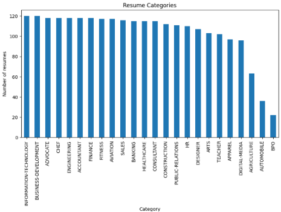
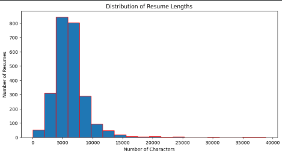
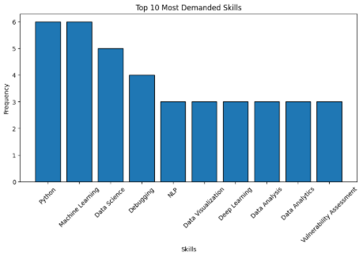
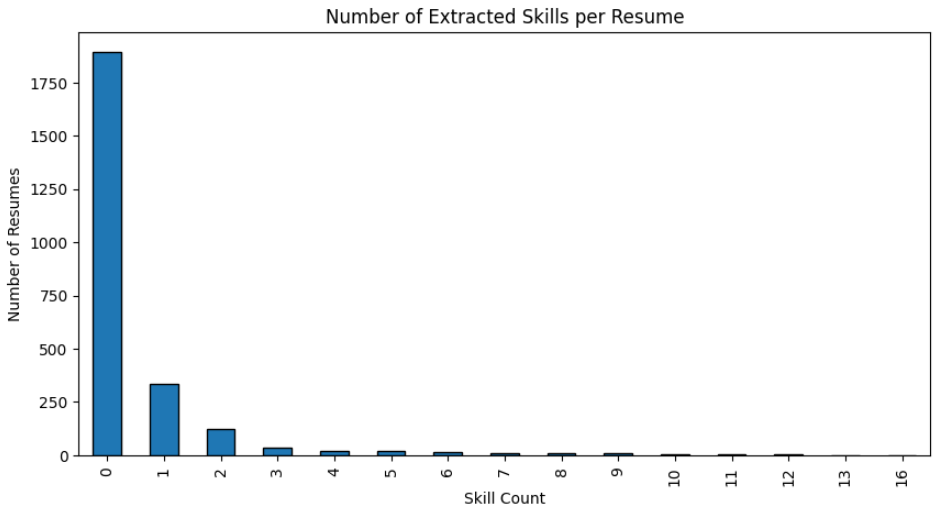
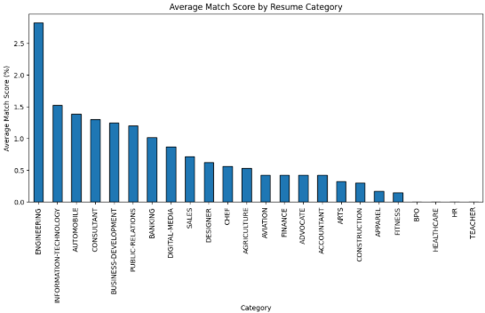

# Resume Screening & Job Matching System using Python and NLP

## Project Overview

This project automates the initial resume screening process by matching candidate skills with job requirements using Python and basic Natural Language Processing (NLP) techniques.

The system extracts relevant skills from resumes, analyzes job descriptions, calculates match scores, and identifies the most suitable candidates for different internship roles.

## Problem Statement

Manual resume screening can be time-consuming and inefficient when dealing with a large number of applications.

The objective of this project is to:

- Extract skills from resumes
- Analyze job descriptions
- Compare candidate skills with job requirements
- Calculate resume-job match scores
- Rank candidates based on skill matching

## Datasets Used

### Resume Dataset
Source: https://www.kaggle.com/datasets/snehaanbhawal/resume-dataset

- 2484 resumes
- Multiple professional domains
- Resume text and category information

### Job Dataset

- 15 internship descriptions collected from Internshala
- Machine Learning
- Data Science
- NLP
- Web Development
- Cyber Security
- Software Development

## Technologies Used

- Python
- Pandas
- NumPy
- Matplotlib
- Regular Expressions (re)

## NLP Techniques Used

The following preprocessing techniques were applied:

1. Lowercasing
2. Special character removal
3. Whitespace normalization
4. Text cleaning
5. Keyword-based skill extraction

## Project Workflow

1. Data Loading
2. Data Understanding
3. Exploratory Data Analysis (EDA)
4. Text Preprocessing
5. Skill Extraction
6. Resume-Job Matching
7. Candidate Ranking
8. Multi-Role Analysis
9. Conclusions and Insights

## Exploratory Data Analysis

The following analyses were performed:

- Resume Category Distribution
- Resume Length Distribution
- Job Role Analysis
- Top Skills Analysis
- Skill Count Distribution
- Match Score Analysis

## Resume Matching Methodology

### Step 1: Skill Extraction

Skills were extracted from resume text using a predefined skill list generated from the job dataset.

### Step 2: Match Score Calculation

Match Score was calculated using:

Match Score =(Number of Matching Skills / Number of Required Job Skills) × 100

### Step 3: Candidate Ranking

Resumes were ranked according to their match scores, with higher scores indicating better alignment with job requirements.

## Sample Visualizations

### Resume Category Distribution

### Resume Length Distribution

### Top Skills in Job Descriptions

### Skill Count Distribution

### Average Match Score by Resume Category

## Key Findings

- Python, Machine Learning, Data Analytics, and NLP were among the most frequently required skills.
- Engineering and Information Technology resumes consistently achieved higher match scores for technical roles.
- Most resumes showed limited overlap with highly specialized internship requirements.
- The system successfully identified relevant candidates based on skill matching.

## Results

The project successfully:

- Extracted skills from resumes
- Compared resumes with job descriptions
- Calculated match scores
- Ranked resumes based on suitability
- Identified best-matching resume categories for different job roles

## Future Improvements

- TF-IDF Vectorization
- Cosine Similarity Matching
- Resume Recommendation System
- Interactive Dashboard
- Automated Candidate Ranking Portal

## Project Structure

AI-Powered-Resume-Screening-System/

├── README.md

├── AI_Powered_Resume_Screening_System.ipynb

├── Jobs.csv

└── images/

## Author

**Iha Pradhan**

B.Tech in Artificial Intelligence & Machine Learning - Symbiosis Institute of Technology,Pune - Batch 2025-29

